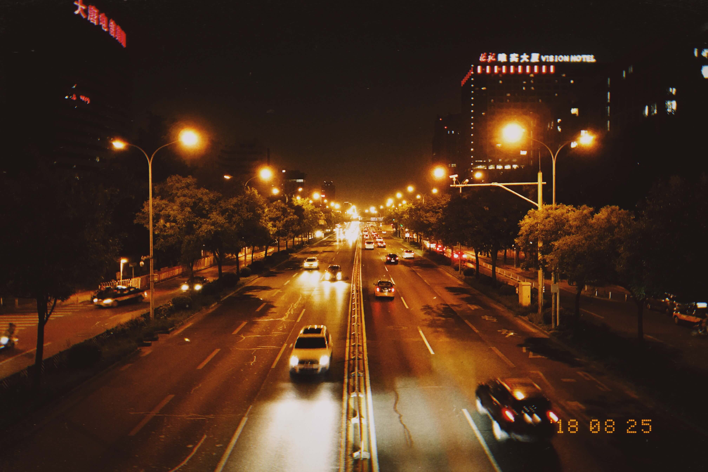
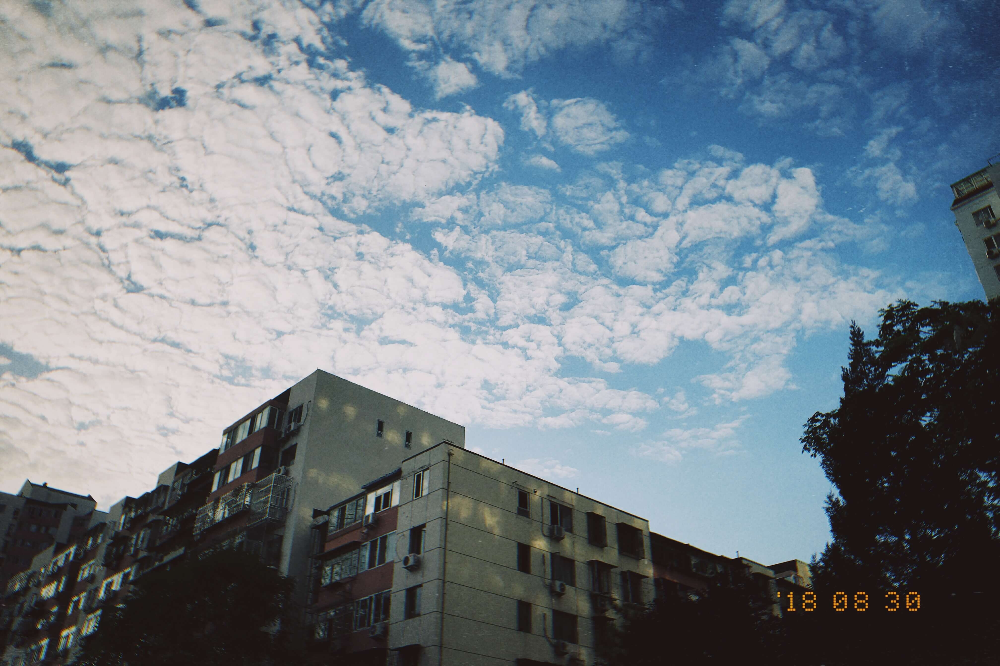
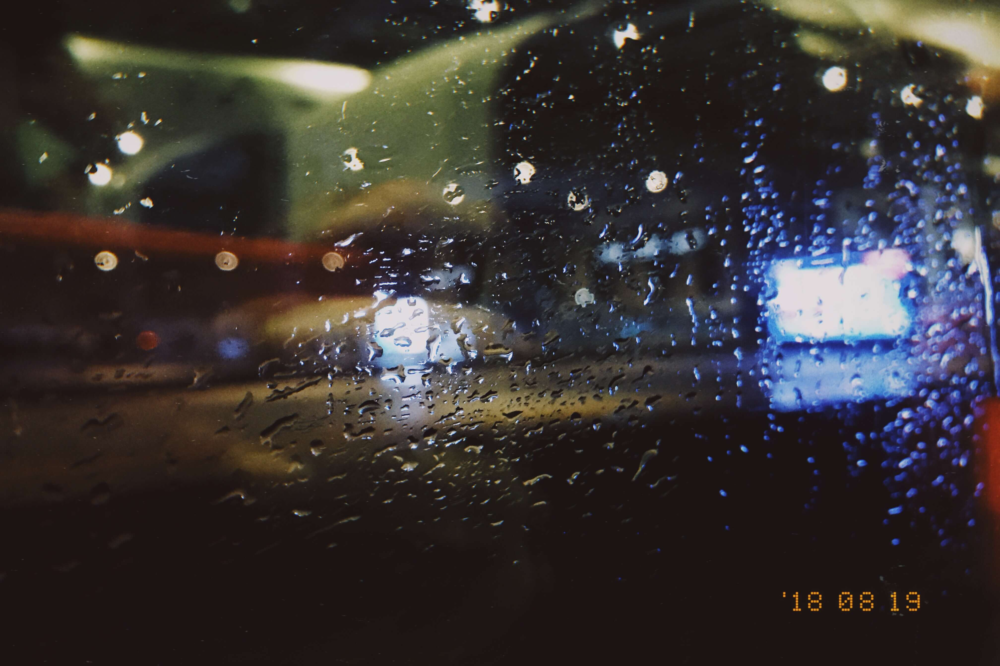

[notice]This is an sample article. Typography matters in Maverick.[/notice]

<!--more-->

## L2 Heading

### L3 Heading

#### L4 Heading

##### L5 Heading

###### L6 Heading

## Paragraph

We are creating a world that all may enter without privilege or prejudice accorded by race, economic power, military force, or station of birth.

We are creating a world where anyone, anywhere may express his or her beliefs, no matter how singular, without fear of being coerced into silence or conformity.

## Inline elements

**Bold**, {{Ruby:ルビ}}, *Italic*, ~~Strikethrough~~, [Link](https://www.imalan.cn)[^Home page for AlanDecode]。

## Blockquote and nested blockquote

> 安得广厦千万间，大庇天下寒士俱欢颜！风雨不动安如山。
> > 呜呼！何时眼前突兀见此屋，吾庐独破受冻死亦足！

## Code

Inline code: `int a=1;`. Code block:

```cpp
int main(int argc , char** argv){
    std::cout << "Hello World!\n";
    return 0;
}
```
## List

### Unordered List

* iPhone
    * iPhone X
    * iPhone 11
* iPad
* MacBook

### Ordered List

1. 打开冰箱
    1. 右手放在冰箱门拉手上
    2. 左手扶住冰箱主体
    3. 右手向后用力
2. 把大象放进冰箱
3. 关上冰箱

## Horizontal rule

------

## Math

Inline Math: $m\times n$, math block:

$$C_{m\times k}=A_{m\times n}\cdot B_{n\times k}$$

## Figures

### Single figure


### Photoset

 ![][1] 
  

## Table

header | header
--------- | -------------
cell 1 | cell 2
cell 3 | cell 4

## Link Card

[links]
[AlanDecode](https://www.imalan.cn)+(https://secure.gravatar.com/avatar/1741a6eef5c824899e347e4afcbaa75d?s=200&r=G&d=)
[/links]


  [1]: ./assets/1463017562.jpg
